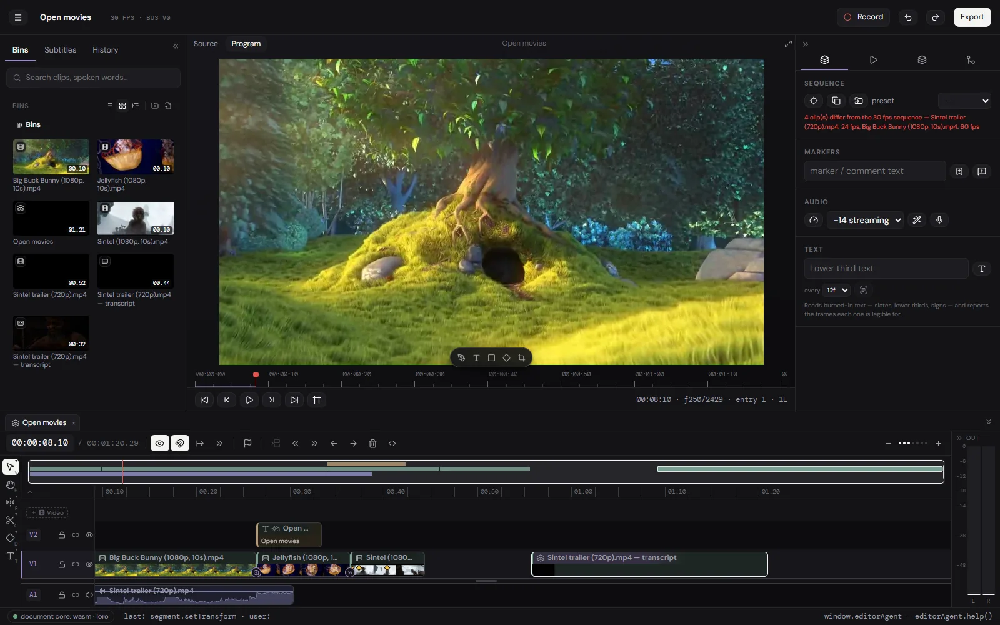
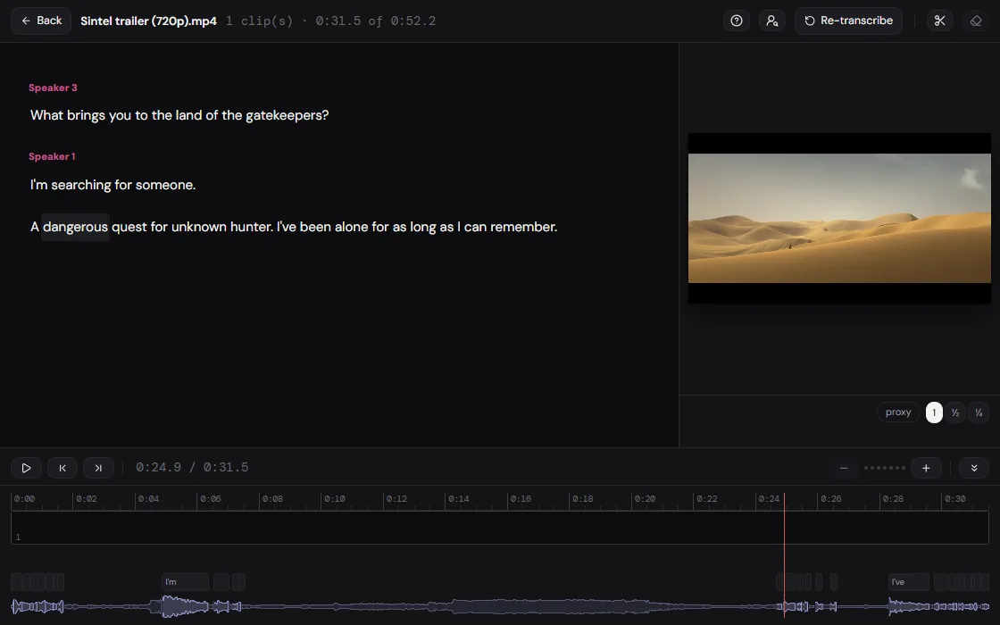
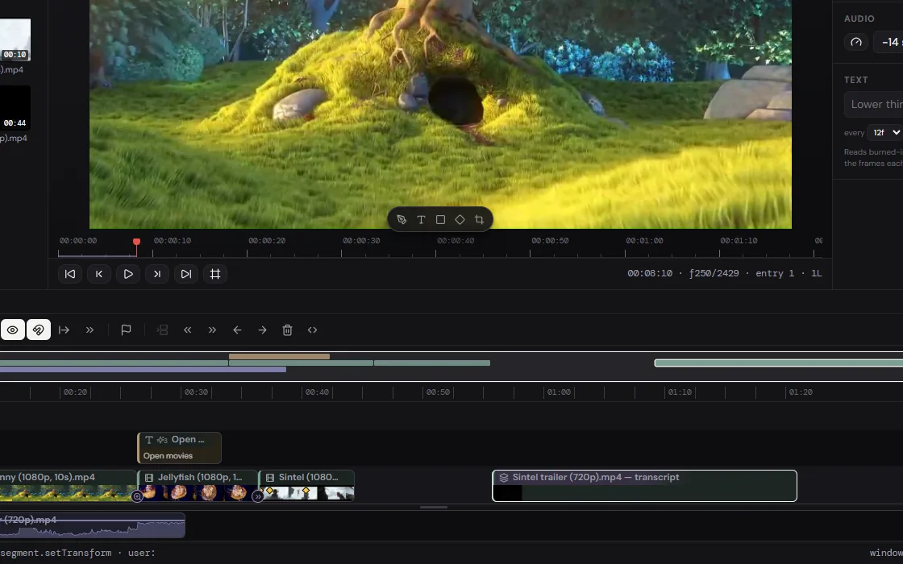
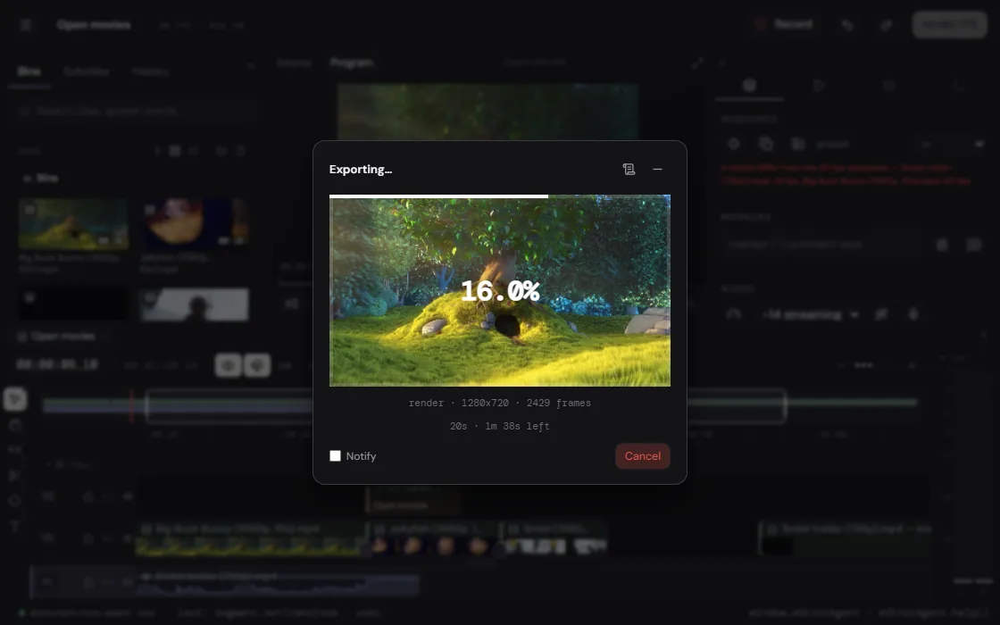
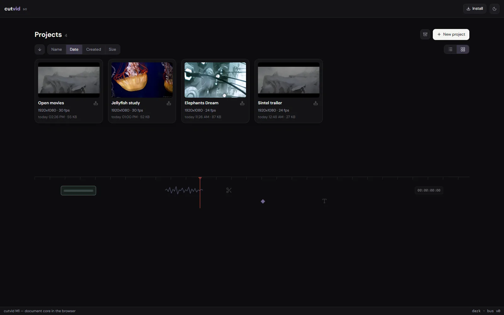

# cutvid

A video editor that runs in a browser tab. Free, no account, and the footage
never leaves the machine.

**[cutvid.okyle.dev](https://cutvid.okyle.dev/)**



This repository is the editor's documentation and its issue tracker. The
source is private; everything a person or a script needs in order to use the
application is here, and anything wrong with it belongs in
[Issues](https://github.com/obillekyle/cutvid-editor/issues).

## What it is

A timeline editor, not a trimmer. Import from the disk, cut, grade, add titles,
caption and export, with no upload at any point: there is no server to upload
to. The application is a set of static files, and once the page has loaded
there is no API it talks to, no bucket the media is copied into, and no
account the work is attached to.

53 named features in this build, across eight groups. The whole inventory is
at [cutvid.okyle.dev/features/](https://cutvid.okyle.dev/features/) and is
generated from the same list the application reads, so the page and the build
cannot disagree.

- **Timeline:** ripple trim, roll, slip, slide, sync-locked tracks, nested
  sequences, freeze frames, speed and reverse, 32 transitions, 23 clip
  animations.
- **Picture:** transform with a keyframeable anchor, crop, chroma key, LUT
  grading from a `.cube`, an effect stack, titles that kern.
- **Sound:** a per-clip chain (denoise, EQ, notch, de-esser, gate, leveller,
  echo, room), loudness to a target, meters.
- **Words:** transcription by Whisper in the tab, speakers, cutting by the
  transcript, caption tracks with looks and presets.
- **Capture:** screen and camera recording straight onto the timeline.
- **Out:** MP4 (H.264/AAC), MOV, MKV, M4A, Opus or WAV, with an untouched
  clip written from the source's own packets rather than re-encoded.

## Nothing is uploaded, and that is checkable

Open the network panel in the browser's developer tools and cut something.
After the page and its assets have loaded there are no further requests: no
upload, no telemetry, no analytics beacon. Or load the page once, turn the
network off, and keep editing. The work carries on, because there was never
anything on the other end of it.

The transcription is the part people assume must be a cloud API, because in
every other editor it is. It is not: Whisper runs in the tab, and the speech
is not sent anywhere.

## What it does not do

- Export is H.264 video and AAC audio in an MP4, or the sound alone as .m4a.
  No ProRes, no DNxHD, no H.265 out, no image sequences.
- No team features: no cloud project, no review link, no comments, no shared
  library. A project lives in one browser, and moves as a file.
- No stock library and nothing generative: no stock clips, no music bed, no
  AI b-roll, no generative fill.
- No third-party plugins. No OpenFX, no VST, no motion-graphics templates
  from another app.
- Colour is LUTs and the effect rail, not scopes, curves and secondaries. A
  `.cube` grades a clip; there is no vectorscope to grade against.
- Built and checked in Chromium browsers, which is where WebCodecs is
  furthest along. Other browsers vary by codec and by version.
- It runs in a tab, on one machine. A long 4K timeline is heavier here than
  in a native application on the same computer.

## What it needs

Chrome, Edge or another Chromium browser, on Windows, macOS, Linux or
ChromeOS. WebCodecs is what the decode and the encode are built on, and it is
furthest along there. It installs as an app and works with the network off.

## Driving it from a script

The running application exposes `window.editorAgent`: every command the
interface uses, on one bus, with the same undo rules. [AGENTS.md](AGENTS.md)
is the reference, also served at
[cutvid.okyle.dev/AGENTS.md](https://cutvid.okyle.dev/AGENTS.md) so an agent
can read it from the origin it is driving.

```js
editorAgent.help()                                    // the reference, printed
editorAgent.importUrls(['/clip.mp4'])
editorAgent.dispatch([{ name: 'segment.split', params: { seq: 'main', track: 1, index: 0, at: 120 } }])
await editorAgent.export('main', { width: 1920, height: 1080, mode: 'full' })
```

## Screenshots

| Cutting by the transcript | The timeline |
|---|---|
|  |  |

| An export in progress | The projects screen |
|---|---|
|  |  |

Demo footage in the pictures: Big Buck Bunny, Sintel and Elephants Dream by
the Blender Foundation, CC BY 3.0.

## Reporting a problem

Issues are open. A report that names the browser and its version, the media
(codec, size, frame rate) and what happened instead is one that can be
reproduced; a screen recording of a timeline going wrong is worth more than a
description of it. Nothing from a project is ever needed to file one, and
nothing should be attached that cannot be published.
